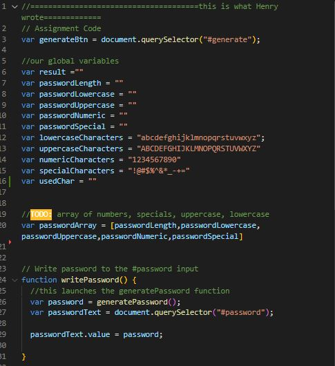
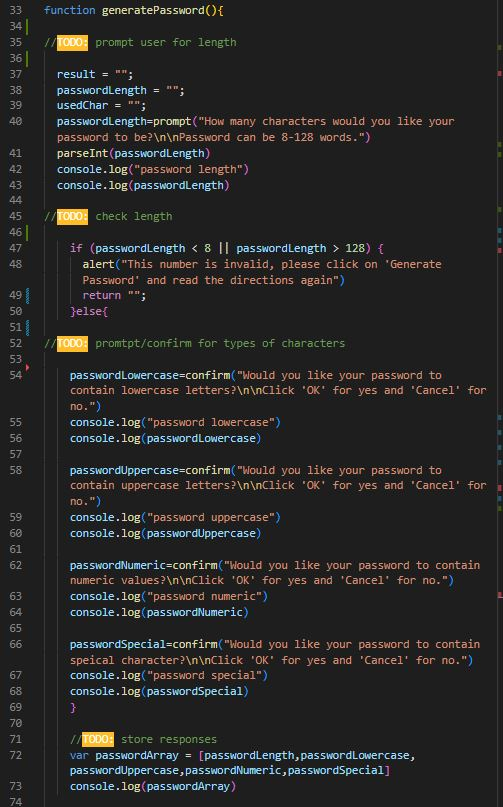
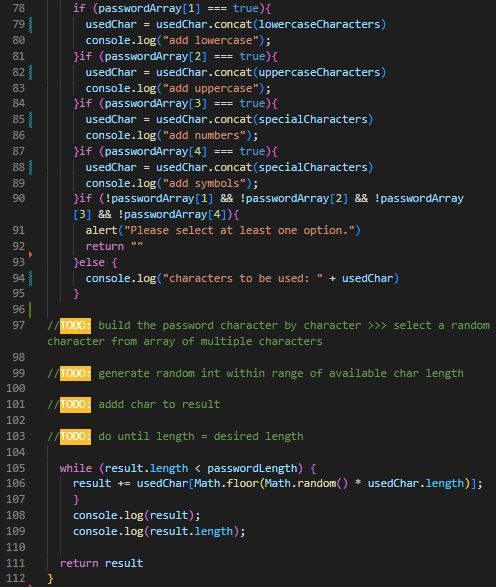
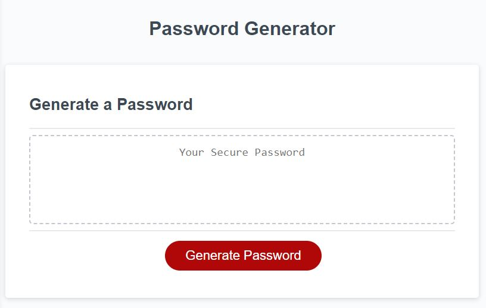
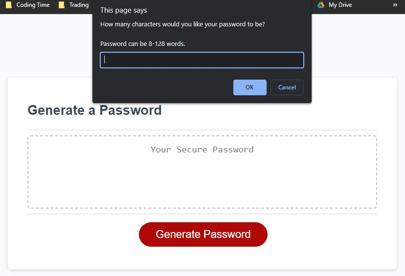
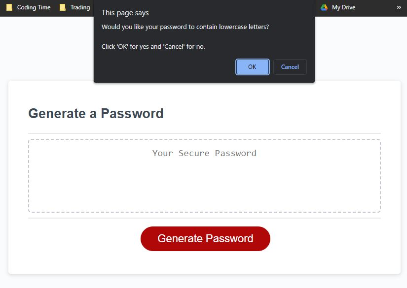
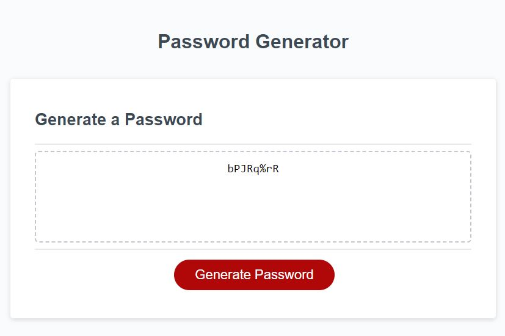

# Password Generator 

## Description

The point of this project was to allow a user to be able to make a randomized password for any website or password protected database/app. Making passwords can be dificult, and it is better security to have a password that is not like any others. THerefore, making a webpage that would allow character randomization from a certain set of characters would serve a great purpose.

## Walking Through the Code
Starting off, we set some global variable to allow functions to call on them later. Second, we made an array containing the prompted values, making them easier to store/call later in the code. The writePassword function allows the program to start the generatePassword function to get our main function started. We start we empty string variables in the begining. This allows us so that when we do not hit certain criterias during the password selecting process, our variables reset, allowing us to start at step one with a 'clean slate' so that it doesn't cause any bugs. The passwordLength prompt is asked and the answer is turned into an integer with the parseInt() code, this will make it so that recalling this value in the future it is a number and not a string. A condition is run to make sure the password length is within our boundary and if it does not, it returns an empty string and the process can be restarted.

Then the criteria for the password is asked in the confirm connotation allowing for the values to be written as true or false. These values are then stored into an array called passwordArray.

```
    
```

The third bit is building our pool of characters used for the password generator, which is asigned to our variable usedChar. The if steps to other ifs allowing them to be added onto each other is the selected value from the array was turned true from the previous prompts. A step I got stuck on here was making an if else on the second step. If the first option was true, the next lines of code were not annitiated, which did not allow the usedChar to be "built" up. The last step of the if statement checks to see if all the values were false, in which an alert says to at least pick one option and the functoin stops with a return of an emtpy string.

    ```
        
    ```

Last piece in this function is the while loop. This allows us to set parameters to conitnually perform the addition of a character as long as the result.legnth (our variable we are changing in this function to hold our randomized password) is lower than the passwordLength inputed at the begining. The equation starts by multiplying a random number to the length of the userChar (the value that holds the characters we want to use). It then rounds this number and muliplies it by the usedChar value to select a character within that string. That character is then added into our result variable. This is run until the length of the result is less than that of the password length. This entire function then ends with the return result, which places our result string in the 'Your Secure Password' on the page.


    ```md
    
    ```


## Table of Contents (Optional)

N/A
## Installation

N/A

## Usage

To start the program click the 'Generate Password' button.

    ```md
    
    ```

Then write in the number of characters you want the length of your password to be and click 'OK'.

    ```md
    
    ```

The next windows, read the directions and answer them depending on the criteria you desire

    ```md
    
    ```
Then, your password will apear in the dotted box, highlight and copy it to your desired location.

    ```md
    
    ```

## Credits

N/A